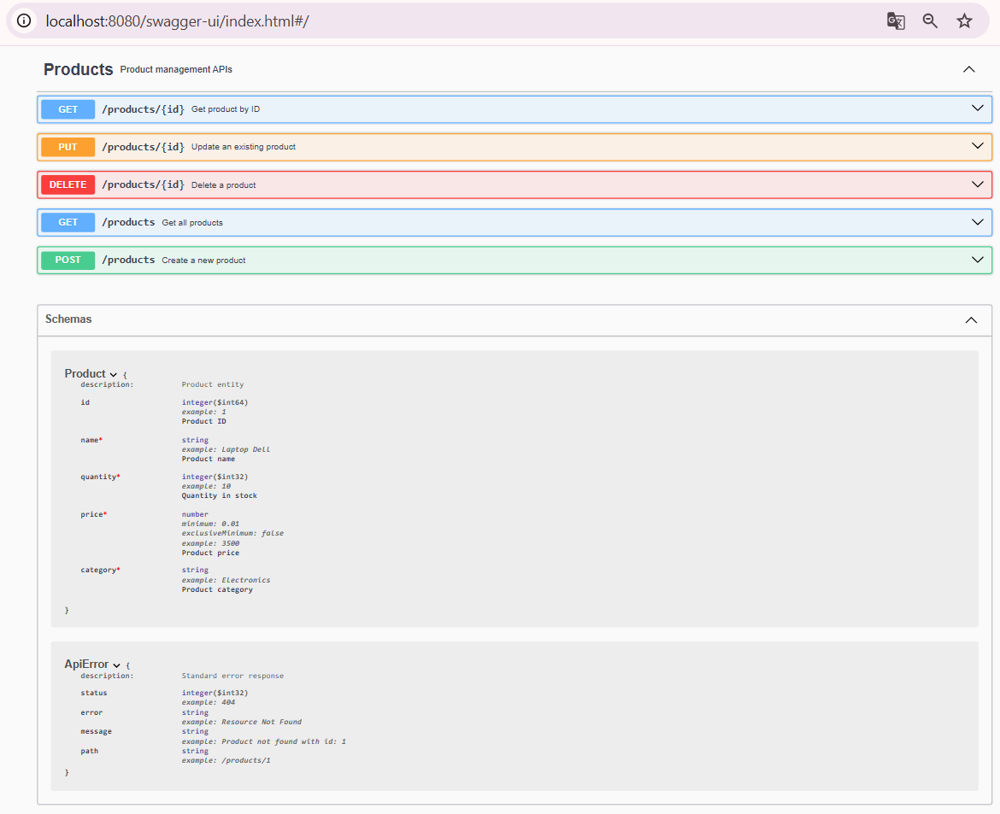
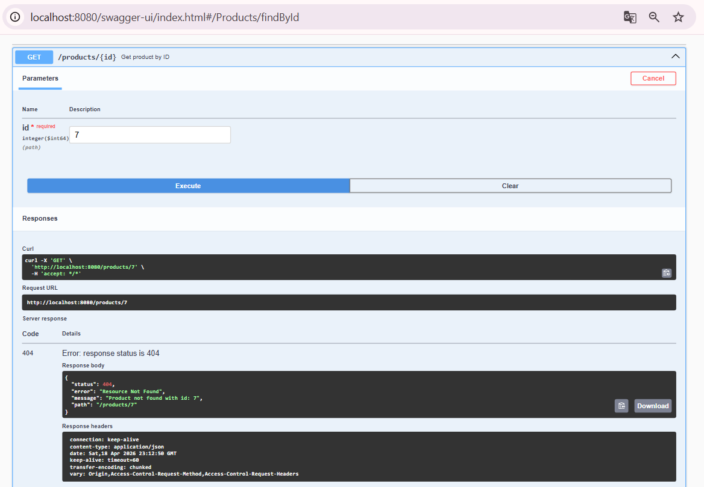

# 📦 Stock Control API

API REST para gerenciamento de produtos em estoque.

> API REST for stock management, built with Spring Boot, featuring validation, exception handling and API documentation.

---

## 🚀 Funcionalidades

- Criar produto
- Listar todos os produtos
- Buscar produto por ID
- Atualizar produto
- Deletar produto
- Validação de dados com Bean Validation
- Tratamento global de exceções
- Documentação interativa com Swagger

---

## 🛠️ Tecnologias

- Java 17
- Spring Boot
- Spring Data JPA
- PostgreSQL
- Swagger (OpenAPI)
- Maven

---

## 🧠 Arquitetura

O projeto segue o padrão em camadas:

- Controller → recebe requisições HTTP
- Service → regras de negócio
- Repository → acesso ao banco de dados

---

## 📚 Documentação da API

A API possui documentação interativa via Swagger:

http://localhost:8080/swagger-ui/index.html

---

## 📷 Preview

### 🔹 API Overview

### 🔹 Example request & response (error handling)

---

## ▶️ Como executar o projeto

### 1. Clonar o repositório

git clone https://github.com/deborajaldir/stock-control.git

### 2. Configurar o banco de dados

No arquivo application.properties:

spring.datasource.url=jdbc:postgresql://localhost:5432/seu_banco  
spring.datasource.username=seu_usuario  
spring.datasource.password=sua_senha

### 3. Rodar a aplicação

mvn spring-boot:run

---

## 🔍 Exemplo de requisição

### Criar produto

{
"name": "Laptop Dell",
"quantity": 10,
"price": 3500.00,
"category": "Electronics"
}

---

## ⚠️ Tratamento de erros

A API retorna erros padronizados:

{
"status": 404,
"error": "Resource Not Found",
"message": "Product not found with id: 1",
"path": "/products/1"
}

---

## 📌 Status do projeto

✅ Backend finalizado  
🚧 Front-end em desenvolvimento

---

## 👩‍💻 Autora

Débora Jaldir

## 💡 Objetivo
Este projeto foi desenvolvido para consolidar conhecimentos em desenvolvimento **full stack**, focando na construção de APIs, integração com bancos de dados e interfaces web modernas.
